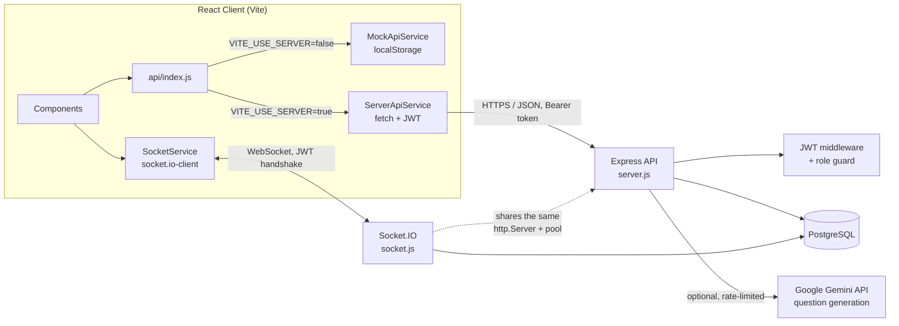
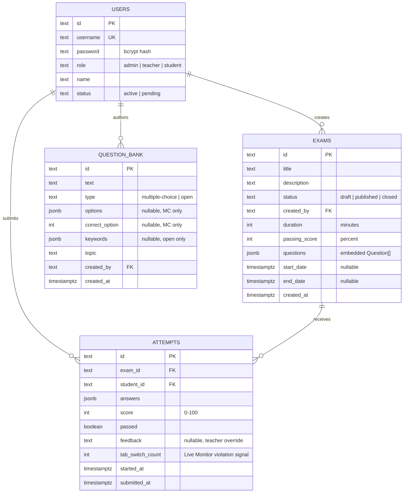
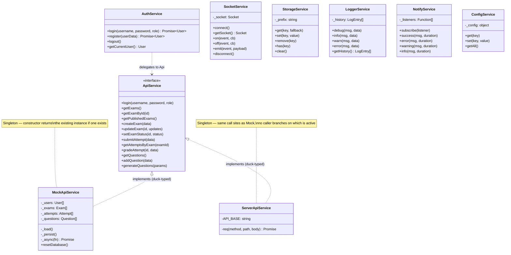
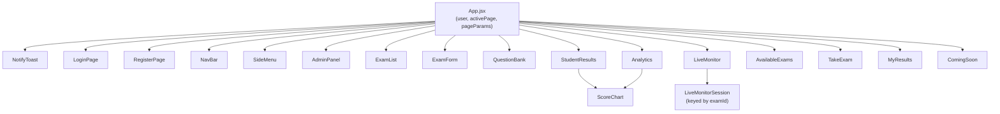
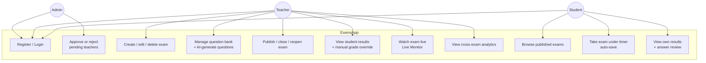
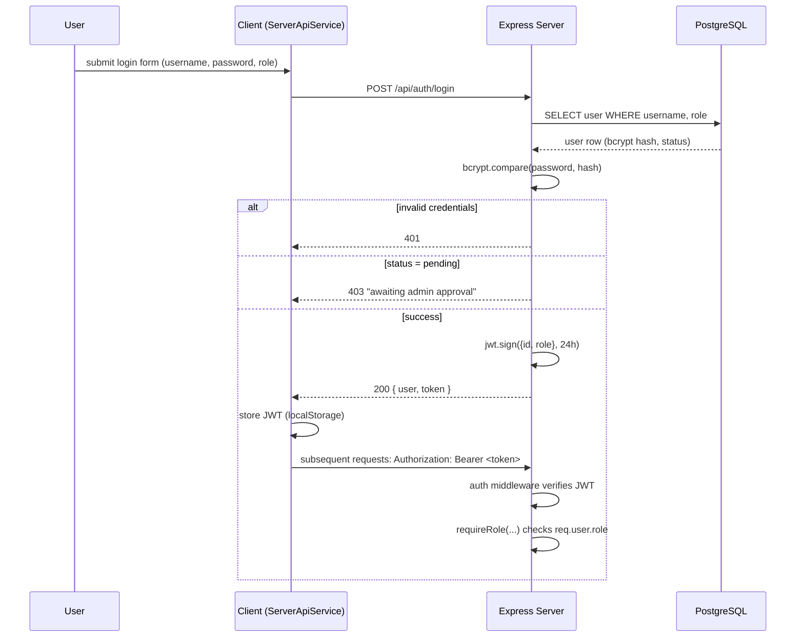
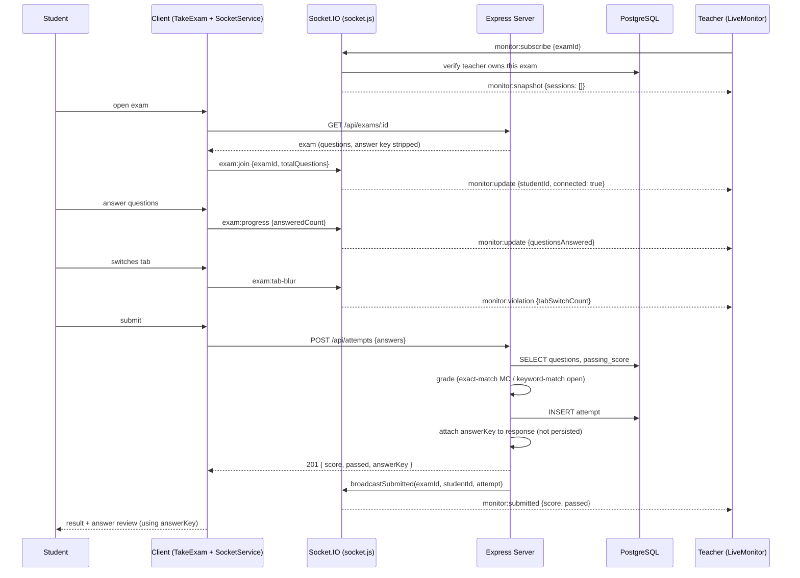
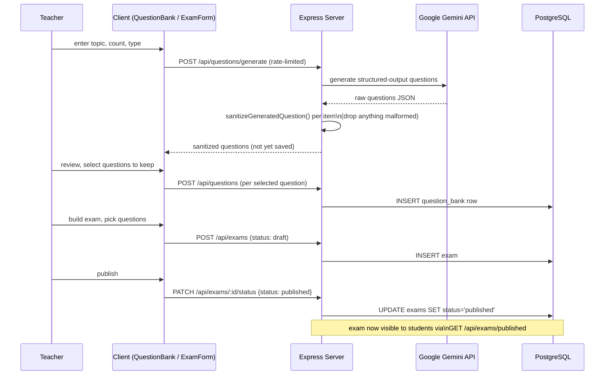
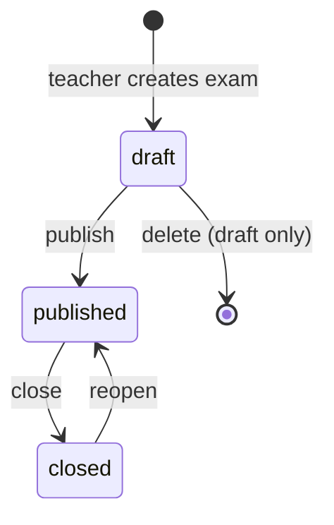

# Architecture & Diagrams

See also: [`API.md`](API.md) for the full endpoint/event reference, [`WORKFLOW.md`](WORKFLOW.md) for milestones, branching, CI/CD, Docker, and testing.

## 1. System Overview



- **No React Router** — `App.jsx` holds `activePage`/`pageParams` state; components navigate via an `onNavigate(page, params)` prop, persisted to `localStorage` so a hard refresh doesn't lose the current page.
- **Dual API layer** — `client/src/api/index.js` swaps between `MockApiService` (localStorage, no backend) and `ServerApiService` (real Express calls with a JWT bearer token) based on `VITE_USE_SERVER`. Both expose the identical method set, so no other client code branches on which one is active.
- **Stateless REST auth** — the server issues a signed JWT (`{ id, role }`, 24h expiry) on login; every protected route runs it through `auth` then an optional `requireRole(...)` guard.
- **Real-time layer** — Socket.IO shares the same HTTP server/port as the REST API and the same CORS origin. It authenticates each connection's handshake with the same JWT the REST layer uses, then powers the Live Monitor feature (see [§7](#7-sequence-diagrams) and [`API.md`](API.md#socketio-events)).
- **Where things live**: users/exams/attempts/question bank rows live in PostgreSQL (the only durable store); a student's in-progress answers and the "current page" live in the browser's `localStorage` (survive a refresh, not a new device); who's *currently* taking an exam lives only in the server's in-memory `activeSessions` map inside `socket.js` (intentionally not persisted — it's live presence, not a record).

## 2. Client Architecture

**Packages**: `react` `react-dom` (UI), `bootstrap` (styling/layout), `socket.io-client` (real-time) — dev-only: `vite`, `vitest` + `@testing-library/react` (tests), `eslint` + `eslint-plugin-react-hooks`.

**Pattern**: no framework-level MVC — this is a flat **components + service-layer** architecture typical of a small React SPA:

```
client/src/
  api/            MockApiService.js, ServerApiService.js, index.js (the swap), mockDb.js (seed data)
  services/       AuthService, ConfigService, LoggerService, NotifyService, StorageService, SocketService
  components/
    navigation/    NavBar, SideMenu
    admin/         AdminPanel
    teacher/       ExamList, ExamForm, QuestionBank, StudentResults, LiveMonitor, Analytics
    student/       AvailableExams, TakeExam, MyResults
    shared/        NotifyToast, ComingSoon, ScoreChart, QuestionImportExport
  App.jsx          owns user/activePage/pageParams state, renders the current page
```

- **Components** are presentational + locally stateful (`useState`/`useEffect`) — no global state manager (no Redux/Context store beyond what `App.jsx` passes down as props). Each top-level page component owns its own data-fetching.
- **Services** (`client/src/services/*`) are all singleton classes (`export default new X()` — one shared instance per browser tab), each wrapping one browser API: `AuthService` (session), `StorageService` (`localStorage`, prefixed keys), `LoggerService` (console + in-memory ring buffer), `NotifyService` (pub/sub toast queue), `ConfigService` (tunable constants), `SocketService` (the Socket.IO client connection). See the [class diagram](#5-oop-class-diagram).
- **API layer** is the one seam that lets the whole client run with zero backend (`VITE_USE_SERVER=false`) — see [§1](#1-system-overview).

## 3. Server Architecture

**Packages**: `express` (HTTP), `pg` (PostgreSQL driver, connection pool), `jsonwebtoken` + `bcryptjs` (auth), `cors` + `helmet` + `express-rate-limit` (hardening), `socket.io` (real-time), `@google/genai` (optional AI question generation), `dotenv` (env loading).

**Pattern**: a single-file **routes + data-access** Express API (no separate MVC controllers/models directories — appropriate for this API's size):

```
server/
  server.js    all REST routes, JWT auth/role middleware, request validation, migrate()
  socket.js    Socket.IO auth + Live Monitor event handlers (registerSocketHandlers)
  db.js        pg Pool setup, SSL heuristic, exported SEED_* fixtures
  schema.sql   base table DDL (applied once via seed.js); server.js's migrate() adds
               later columns idempotently (ADD COLUMN IF NOT EXISTS) on every boot
  seed.js      applies schema.sql + inserts SEED_* data — used by npm run seed and CI
```

- Route handlers follow a consistent shape: `auth` (JWT) → optional `requireRole(...)` → an inline `async` handler wrapped in `wrap()` (forwards thrown/rejected errors to the central error-handling middleware, since Express doesn't do this automatically for `async` functions).
- Reusable column-alias lists (`EXAM_COLS`, `ATTEMPT_COLS`, `QB_COLS`) keep every `SELECT` returning the same camelCase shape the client expects, in one place.
- `socket.js` is a factory (`registerSocketHandlers(io, pool)`) that closes over an in-memory `activeSessions` map and returns two functions (`getTabSwitchCount`, `broadcastSubmitted`) that `server.js`'s `POST /api/attempts` calls directly — the bridge between the stateless REST world and the stateful real-time world.

## 4. Database — ERD & JSON Models

Reflects the live schema (`users`, `exams`, `attempts`, `question_bank`) as created by `server/schema.sql` and kept current by `migrate()` in `server/server.js`.



Notes:
- `exams.questions` embeds question snapshots rather than referencing `question_bank` rows — the bank is a reusable authoring source, not a live foreign key, so editing a bank question doesn't retroactively change past/existing exams. `PUT /api/exams/:id` refuses to change `questions` once ≥1 attempt exists, since answers are stored positionally against that exact question order.
- Auto-grading (`POST /api/attempts`) is exact-index match for `multiple-choice`, case-insensitive keyword containment for `open`.
- `GET /api/exams*` strips `correctOption`/`keywords` out of `questions` for students; the real values are only attached (response-only, never persisted) to the `POST /api/attempts` response after a student submits.

### JSON Models (wire shapes, camelCase — as the client actually receives them)

```jsonc
// Exam
{
  "id": "e1", "title": "JavaScript Basics", "description": "…",
  "status": "published", "createdBy": "u1",
  "duration": 20, "passingScore": 60,
  "startDate": null, "endDate": null, "createdAt": "2026-01-10T10:00:00.000Z",
  "questions": [
    { "id": "q1", "text": "What is a closure?", "type": "multiple-choice",
      "options": ["…", "…", "…", "…"], "correctOption": 0 },   // stripped for students pre-submit
    { "id": "q2", "text": "Explain useEffect.", "type": "open",
      "keywords": ["side effect", "lifecycle"] }                // stripped for students pre-submit
  ]
}

// Attempt (as returned right after POST /api/attempts)
{
  "id": "a_173...", "examId": "e1", "studentId": "u3",
  "answers": [0, "a closure captures its lexical scope"],
  "score": 100, "passed": true, "feedback": null,
  "startedAt": "…", "submittedAt": "…", "tabSwitchCount": 0,
  "answerKey": [{ "correctOption": 0, "keywords": null }, { "correctOption": null, "keywords": [...] }]
}

// Question (bank)
{
  "id": "qb1", "text": "What is a closure in JavaScript?", "type": "open",
  "keywords": ["closure", "lexical", "scope"], "topic": "JavaScript",
  "createdBy": "u1", "createdAt": "…"
}

// User (public shape — password never leaves the server)
{ "id": "u3", "username": "student1", "role": "student", "name": "Alice", "status": "active" }
```

## 5. OOP Class Diagram

The client's service and API layer is the most explicitly object-oriented part of the codebase — every service is a class instantiated exactly once (`export default new X()`), shared across the whole tab.



## 6. Component Hierarchy



Role → default landing page: `admin` → Admin Panel, `teacher` → My Exams, `student` → Available Exams.

## 7. Use Case Diagram



## 8. Sequence Diagrams

Three scenarios that between them touch every layer of the system.

### 8.1 — Login (stateless JWT auth)



### 8.2 — Take Exam, Live Monitor, Submit

Shows the REST and real-time layers cooperating: the teacher watches a student's progress live, then gets notified the instant the student submits — with no polling on either side.



### 8.3 — AI-Assisted Question Creation → Exam Publish



## 9. Exam Status Flow



- `draft` — visible only to its creator, editable/deletable.
- `published` — visible to all students, acceptable for attempts, not deletable, questions locked once ≥1 attempt exists.
- `closed` — no new attempts accepted; existing results remain visible.
