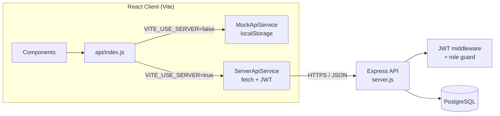
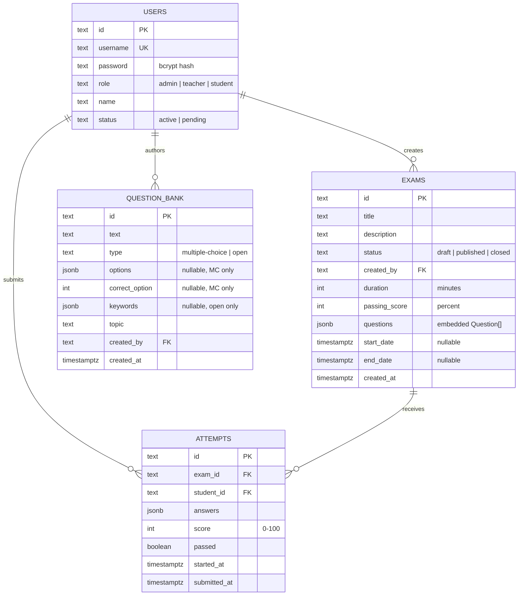
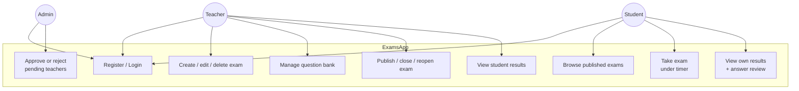
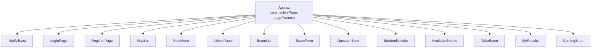
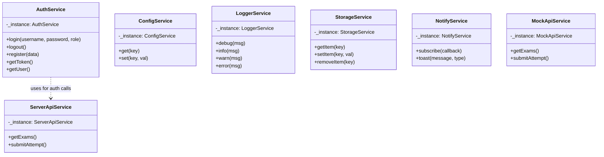
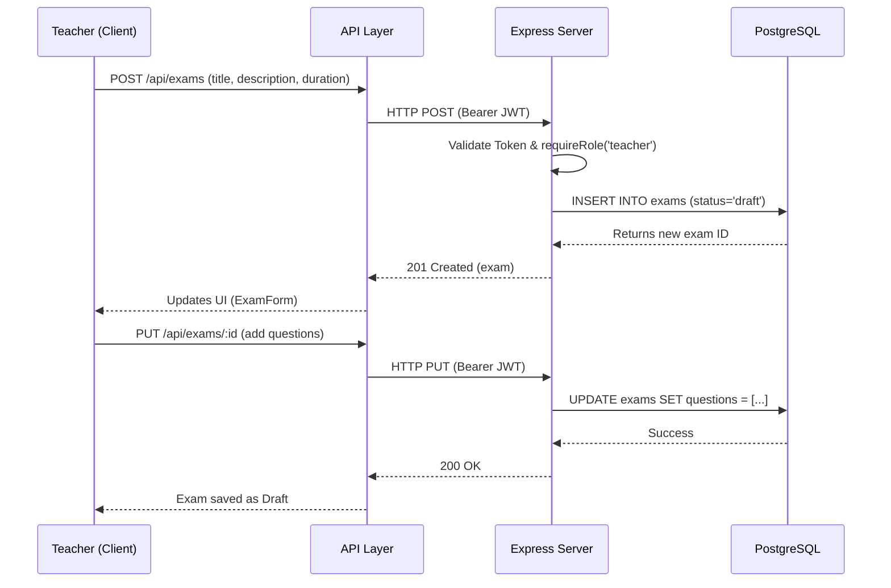
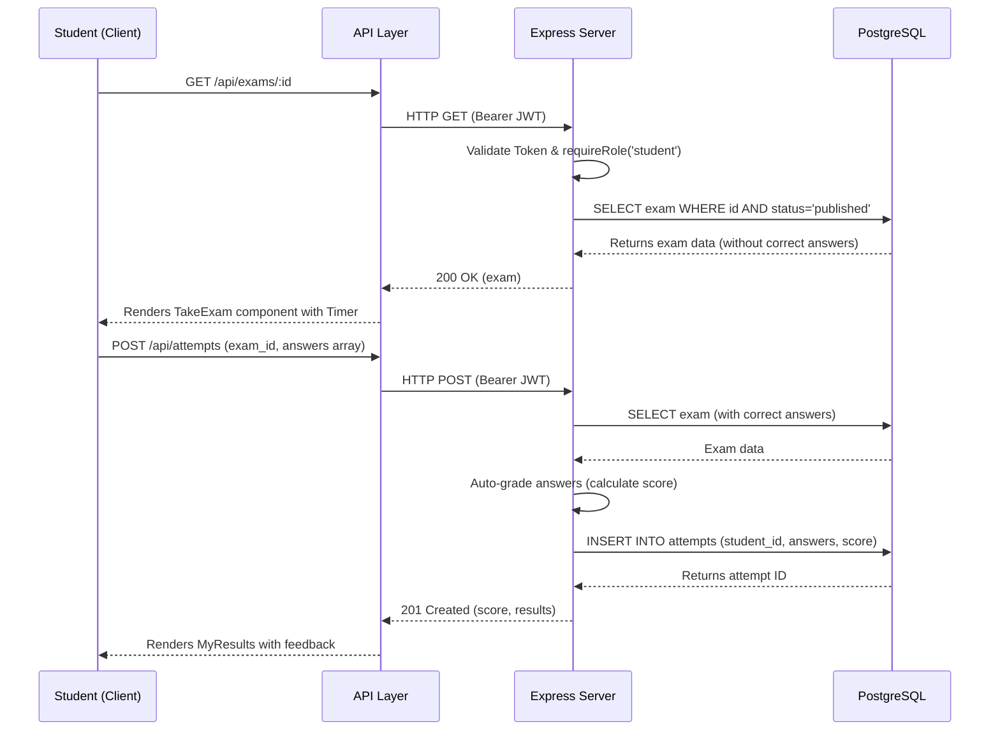
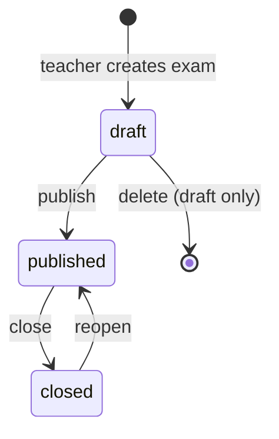

# Architecture & Diagrams

## System Overview (Client / Server / DB / Services)

The system is split into three main layers: **Client**, **Server**, and **Database**.
- **Data Flow**: The user interacts with the **React Client** components. These components delegate business logic and data fetching to the **Client Services** and **API Layer**. The API layer sends HTTP/JSON requests to the **Express Server**. The Server routes requests, checks JWT authorization via middleware, performs business logic, and executes SQL queries against the **PostgreSQL Database**. The data is then serialized to JSON and sent back to the Client.
- **Data Storage**: User credentials, exams, questions, and attempts are persisted securely in the PostgreSQL database.
- **Interface**: The Client talks to the Server via a RESTful API (JSON over HTTPS).

- **No React Router** — `App.jsx` holds `activePage`/`pageParams` state; components navigate via an `onNavigate(page, params)` prop.
- **Dual API layer** — `client/src/api/index.js` swaps between `MockApiService` (localStorage, no backend) and `ServerApiService` (real Express calls with a JWT bearer token) based on `VITE_USE_SERVER`.
- **Stateless auth** — the server issues a signed JWT (`{ id, role }`, 24h expiry) on login; every protected route runs it through `auth` then an optional `requireRole(...)` guard.

## Entity-Relationship Diagram

Reflects the live schema (`users`, `exams`, `attempts`, `question_bank`) as created/maintained by `server/schema.sql` + `migrate()` in `server/server.js`.

Notes:
- `exams.questions` embeds question snapshots (id/text/options/correctOption or keywords) rather than referencing `question_bank` rows — the bank is a reusable authoring source, not a live foreign key relationship, so editing a bank question doesn't retroactively change past/existing exams.
- `users.role` includes `admin`, used only for the teacher-approval workflow (no admin-authored exams in practice, though the API permits it).
- Auto-grading (`POST /api/attempts`) is exact-index match for `multiple-choice`, case-insensitive keyword containment for `open`.

## Use Case Diagram

## Component Hierarchy

Role → default landing page: `admin` → Admin Panel, `teacher` → My Exams, `student` → Available Exams.

## OOP UML Diagram (Client Services)

The client uses several Singleton services to manage state, configuration, and API communication in an Object-Oriented manner.

## Sequence Diagrams (Main Scenarios)

### 1. Authentication (Login) Sequence

### 2. Teacher Creates Exam Sequence

### 3. Student Takes Exam Sequence

## Exam Status Flow

- `draft` — visible only to its creator, editable/deletable.
- `published` — visible to all students, acceptable for attempts, not deletable.
- `closed` — no new attempts accepted; existing results remain visible.
